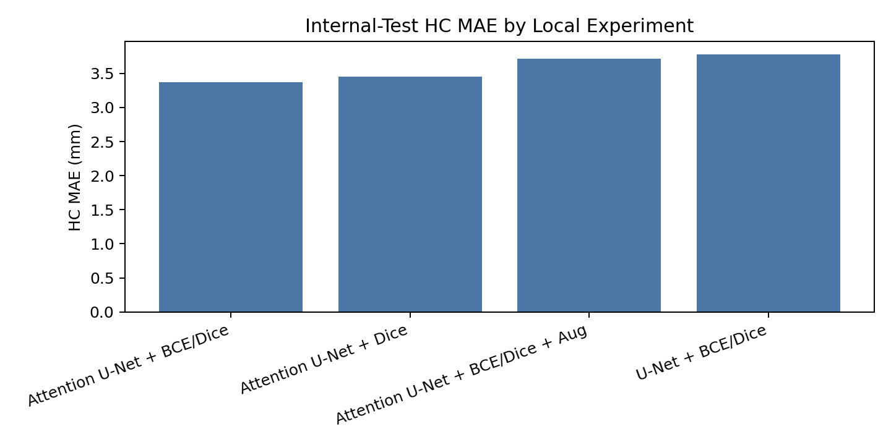
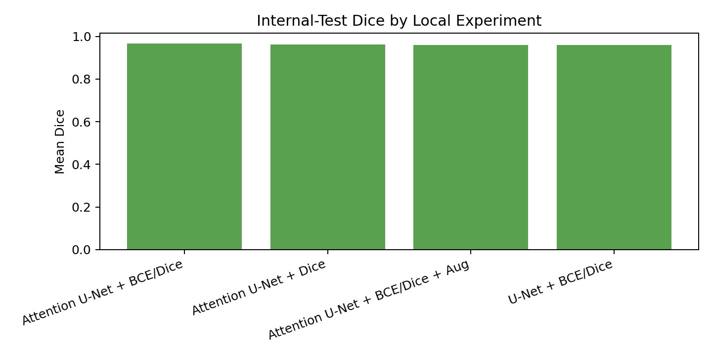
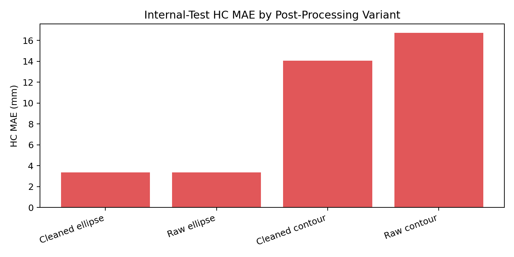

# Automated Fetal Head Circumference Measurement from 2D Ultrasound Using Attention U-Net and Ellipse-Based Geometry

## 1. Introduction

Fetal head circumference (HC) is an important biometric measurement in prenatal ultrasound because it is used to monitor fetal growth and estimate gestational age. In routine clinical use, HC is measured from a standard fetal head plane by identifying the skull boundary and fitting an ellipse. This manual workflow can be time-consuming and depends on image quality and operator consistency. The goal of this project is to automate HC estimation from 2D ultrasound images by first segmenting the fetal head and then converting the predicted mask into an ellipse-based physical measurement.

The task is challenging for several reasons. Ultrasound images contain speckle noise, acoustic shadowing, low contrast boundaries, and local artifacts. The fetal skull contour may be incomplete or visually ambiguous, and small segmentation errors can affect the final circumference measurement. Therefore, this project evaluates both segmentation quality and downstream HC measurement error rather than treating mask overlap as the only objective.

This project uses the HC18 fetal head circumference dataset and challenge. The full challenge dataset contains 1,334 2D ultrasound images, with 999 labeled training images and 335 official test images. Since local labels are available for the training set, this project creates a deterministic train/validation/internal-test split from the 999 labeled images and reports results on the held-out internal-test split.

## 2. Method

The pipeline is segmentation-first:

```text
ultrasound image -> neural segmentation model -> binary mask -> largest component -> ellipse fit -> HC in mm
```

Two deep convolutional segmentation models were implemented in PyTorch. The baseline is a U-Net encoder-decoder model with skip connections. The improved model is an Attention U-Net, which adds additive attention gates to the decoder skip connections so that skip features are weighted before concatenation. Both models are non-trivial deep neural networks with approximately 1.9 million trainable parameters in the local configuration.

The models output one logit map with the same spatial size as the input image. During training, logits are compared against binary masks derived from HC18 annotations. The main training loss is a weighted BCE+Dice loss:

```text
L = 0.5 * BCEWithLogits + 0.5 * DiceLoss
```

where DiceLoss is computed from sigmoid probabilities and ground-truth masks. I also evaluated a Dice-only loss ablation. The optimizer was AdamW with learning rate 0.001 and weight decay 0.0001.

One training-only augmentation ablation was tested. It used horizontal flipping, mild intensity scaling, intensity shifting, and small Gaussian noise. The same validation and internal-test preprocessing was used for all experiments; augmentation was applied only to the training split.

For inference, model probabilities were thresholded at 0.5. The final HC measurement method keeps the largest connected foreground component, extracts the external contour, fits an ellipse with OpenCV, samples points on that ellipse, scales the points by the per-image pixel spacing, and computes the closed polyline length in millimeters. This separates the neural segmentation problem from the deterministic geometry problem and makes the measurement stage easy to inspect and ablate.

## 3. Experiments

### Dataset and Splits

The labeled HC18 training set was split deterministically into train, validation, and internal-test sets:

| Split | Images |
|---|---:|
| Train | 698 |
| Validation | 152 |
| Internal test | 149 |

The split id was `seed42_train698_val152_test149`. Images were grouped by exam prefix before splitting to avoid placing near-duplicate acquisitions from the same exam across different splits. The official HC18 test set was not used for the reported quantitative metrics because local ground-truth labels are not provided for that set.

Due to local compute constraints, the v1 experiments used a reduced-resource setup allowed by the project instructions:

| Setting | Value |
|---|---|
| Image size | 256x384 |
| Base channels | 16 |
| Epochs | 10 |
| Compute | MacBook MPS |
| Framework | PyTorch |

The reduced setup uses the full labeled split partition but lower image resolution and a smaller model width than the larger CHPC configuration planned for future reruns.

### Metrics

Segmentation was evaluated with Dice, IoU, and HD95. Dice and IoU measure mask overlap, where higher is better. HD95 is the symmetric 95th percentile Hausdorff distance between predicted and target mask boundaries in millimeters, where lower is better.

HC measurement was evaluated with signed HC error, mean absolute error (MAE), and root mean squared error (RMSE), all in millimeters. MAE is the primary measurement metric because the final task is to estimate fetal head circumference.

### Main Results

Table 1 shows internal-test results for the main local experiments.

| Experiment | Dice | IoU | HD95 (mm) | HC MAE (mm) | HC RMSE (mm) |
|---|---:|---:|---:|---:|---:|
| Attention U-Net + BCE/Dice | **0.9669** | **0.9373** | **2.38** | **3.37** | **4.68** |
| Attention U-Net + Dice | 0.9615 | 0.9293 | 2.48 | 3.45 | 5.13 |
| Attention U-Net + BCE/Dice + Aug | 0.9606 | 0.9275 | 2.83 | 3.72 | 5.85 |
| U-Net + BCE/Dice | 0.9600 | 0.9261 | 3.02 | 3.78 | 5.56 |

Attention U-Net with BCE+Dice performed best across all reported internal-test metrics. Compared with the U-Net baseline, it improved Dice from 0.9600 to 0.9669 and reduced HC MAE from 3.78 mm to 3.37 mm. This suggests that attention-gated skip connections helped the segmentation model focus on relevant fetal head structures under the local training setup.

The Dice-only ablation performed worse than BCE+Dice, especially in RMSE. This suggests that the BCE term helped stabilize pixel-level learning while Dice encouraged overlap. The simple augmentation ablation also did not improve performance in this local setup. It is possible that the augmentation strength, training duration, or dataset size made this recipe less helpful; future work should tune augmentation more carefully rather than concluding that augmentation is generally unhelpful.





### Post-Processing Ablation

Because the project goal is HC measurement, I also evaluated measurement variants after segmentation. Table 2 compares direct contour measurement against ellipse-based measurement for the best model.

| Post-processing variant | HC MAE (mm) | HC RMSE (mm) |
|---|---:|---:|
| Cleaned ellipse | **3.37** | **4.68** |
| Raw ellipse | 3.37 | 4.68 |
| Cleaned contour | 14.04 | 16.18 |
| Raw contour | 16.73 | 21.27 |

Direct contour-length measurement strongly overestimated HC. This happened because binary mask contours are jagged and can include small noisy regions. Ellipse fitting regularized the predicted boundary into the clinically relevant head-shape assumption and reduced HC MAE from 16.73 mm for raw contour measurement to 3.37 mm for cleaned ellipse measurement. In this run, raw-largest-contour ellipse and cleaned ellipse matched because ellipse fitting already used the largest external contour. The important conclusion is that ellipse fitting, not raw contour length, should be used for the final HC measurement.



## 4. Conclusions

This project implemented a complete PyTorch pipeline for automatic fetal head circumference measurement from HC18 ultrasound images. The best local model was Attention U-Net trained with BCE+Dice loss, followed by largest-component cleanup and ellipse-based geometric measurement. This model achieved internal-test Dice 0.9669 and HC MAE 3.37 mm under a reduced-resource local setup.

The experiments show that segmentation architecture and post-processing both matter. Attention U-Net improved over the U-Net baseline, while Dice-only loss and the tested simple augmentation did not improve HC error. The post-processing ablation was especially important: direct contour length produced large overestimates, while ellipse fitting produced much lower measurement error.

The main limitation is compute scale. The v1 results used reduced image resolution, smaller model width, and 10 training epochs on a MacBook MPS backend. Future work should rerun the same pipeline on CHPC with larger images, wider models, and longer training. Other useful extensions include tuning augmentation strength, inspecting high-error cases, evaluating official challenge-style test submissions, and building a lightweight demo for presentation.

## References

1. Thomas L. A. van den Heuvel, Dagmar de Bruijn, Chris L. de Korte, and Bram van Ginneken. "Automated measurement of fetal head circumference using 2D ultrasound images." *PLOS ONE*, 13(8), e0200412, 2018.
2. HC18 Grand Challenge. https://hc18.grand-challenge.org/
3. Thomas L. A. van den Heuvel, Dagmar de Bruijn, Chris L. de Korte, and Bram van Ginneken. "Automated measurement of fetal head circumference using 2D ultrasound images" [Data set]. Zenodo. DOI: 10.5281/zenodo.1327317. https://doi.org/10.5281/zenodo.1327317
4. Olaf Ronneberger, Philipp Fischer, and Thomas Brox. "U-Net: Convolutional Networks for Biomedical Image Segmentation." MICCAI, 2015. arXiv:1505.04597.
5. Ozan Oktay et al. "Attention U-Net: Learning Where to Look for the Pancreas." arXiv:1804.03999, 2018.
6. Adam Paszke et al. "PyTorch: An Imperative Style, High-Performance Deep Learning Library." NeurIPS, 2019. arXiv:1912.01703.

## Notes For Final PDF Conversion

- Keep the final PDF under 6 pages.
- Use internal-test rows for the main comparison.
- Include only 2-3 figures to avoid crowding.
- State clearly that local v1 uses reduced-resource settings.
- Add a short note that no external public model code was copied; implementations are project-local PyTorch modules based on published architectures.
